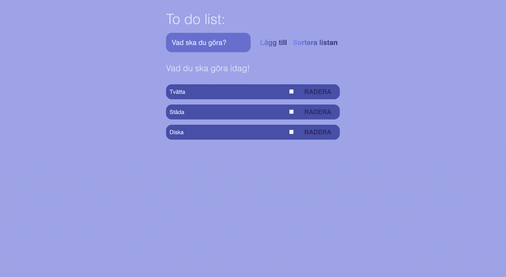

# Todo-lista

Andra inlämningsuppgiften i kursen "Arbetsmetodik för utvecklare" på Medieinstitutet.

## Om projektet

Det här är en webbsida för att skapa en todo lista där man kan skriva nya todos, markera utförda uppgifter men även radera dessa helt. Webbsidan är ett tidigare projekt som med hjälp av den lästa kursen "Arbetsmetodik för utvecklare" ska ge färdigheter att förbättra den befintliga koden och dess struktur. Samt att få kunskaper om hur man ska skriva sina commits på ett korrekt sätt, hur man skapar issues, branches och hantering av pull requests.

- [x] Dokumentation README
- [] Förbättra fil-struktur
- [] Konvertera till TypeScript
- [] Enhetlig kodkvalitet
- [] Refaktorera
- [] Ta bort onödig kod
- [] Tillgänglighetsgranskning
- [] Lighthouse-analys

## Använts i projektet

- GitHub
- Javascript
- HTML
- SCSS/CSS

## Kom igång

1.  Klona ned det här repot och öppna i ett utvecklingsverktyg.

        git clone "https://github.com/Medieinstitutet/inlamningsuppgift-2-Malinaahlin.git"

2.  Installation

    npm install

3.  Starta projekt

    npm run dev

## Mer om mig

MALIN ÅHLIN

- [LinkedIn](https://www.linkedin.com/in/malin-aahlin/)
- [Github](https://github.com/Malinaahlin)
